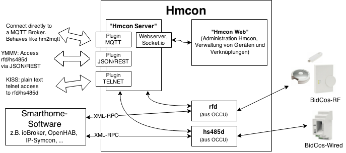

# Hmcon

Homematic Funk-/Wired-Schnittstellen-Software


Hmcon dient als Schnittstelle zwischen Smarthome-Software (wie z.B. hm2mqtt, ioBroker oder OpenHAB) und Homematic Funk-
und Wired-Geräten. Hierfür kommen die Schnittstellenprozesse "rfd" und "hs485d" zum Einsatz, die
[eQ-3](http://www.eq-3.de) als Teil der [OCCU](https://github.com/eq-3/occu) in Binärform unter der
["HMSL" Lizenz](https://github.com/eq-3/occu/blob/master/LicenseDE.txt) zur Verfügung stellt. Auf die Logikschicht
"ReGa" und das HomeMatic WebUI wird bewusst verzichtet, Hmcon nutzt den
[Homematic Manager](https://github.com/hobbyquaker/homematic-manager) als Weboberfläche zur Verwaltung von Geräten und
Direktverknüpfungen.


## Installation

Hmcon wird mit einem interaktiven Shell-Script installiert, dass die benötigten Software-Komponenten herunterlädt sowie
Konfigurationsdateien und Startscripte anlegt.

```Shell
wget https://github.com/hobbyquaker/hmcon/raw/master/hmcon-setup.sh
chmod a+x hmcon-setup.sh
sudo ./hmcon-setup.sh
```

Updates können ebenfalls mit hmcon-setup.sh durchgeführt werden.

Bisher auf folgenden Betriebssystemen getestet:

* Debian Wheezy (armhf)
* Ubuntu 14.04 (amd64)

Unterstützte Architekturen: armhf, i386, amd64

Um Hmcon auf einem 64Bit Betriebssystem auszuführen siehe
https://www.thomas-krenn.com/de/wiki/Debian_7_32bit_Libraries oder http://askubuntu.com/questions/454253/how-to-run-32-bit-app-in-ubuntu-64-bit.


## Todo

* Testen!
* siehe Todo-Liste des Homematic Manager: https://github.com/hobbyquaker/homematic-manager/blob/master/Readme.md#Todo
* hs485d testen, hs485d-Startscript
* Sicherheitsschlüssel setzen
* Backup/Restore (Restore auch aus CCU Backup, import der Namen aus regadom)
* eq3configcmd

### Ausblick



## Lizenzen


### hmcon

[MIT](http://de.wikipedia.org/wiki/MIT-Lizenz)

### Homematic Manager

Copyright (c) 2014, 2015 Anli, Hobbyquaker

[CC BY-NC-SA 4.0](http://creativecommons.org/licenses/by-nc-sa/4.0/)

#### OCCU

[eQ-3](http://www.eq-3.de) [HMSL](https://github.com/eq-3/occu/blob/master/LicenseDE.txt)
